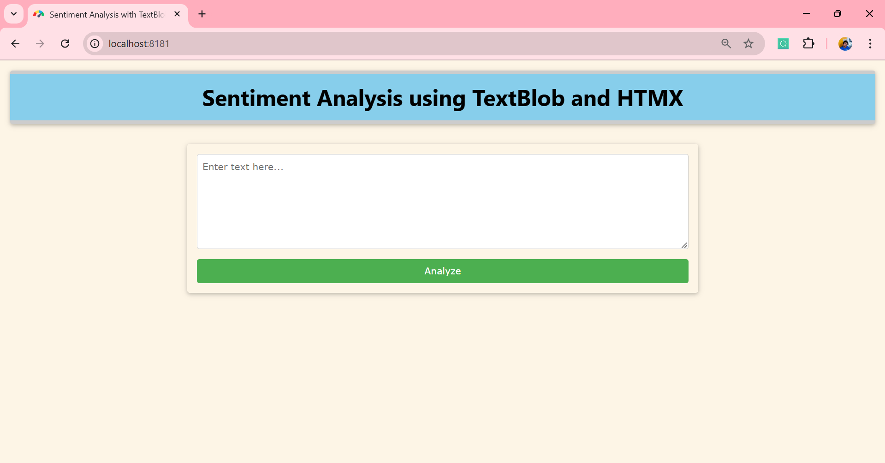
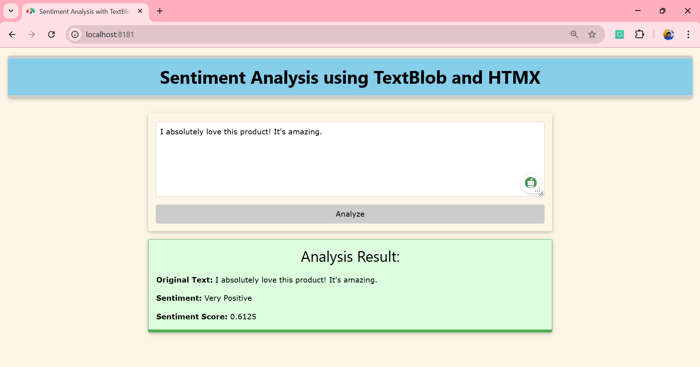
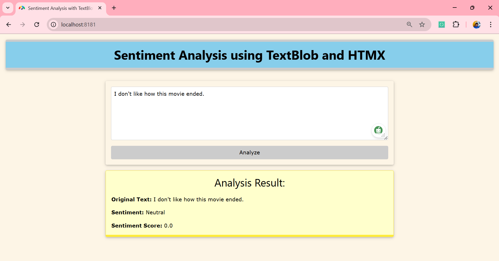
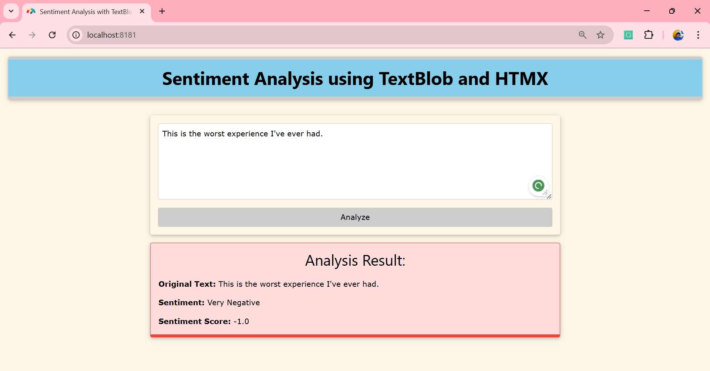

# Sentiment Analysis with Flask, TextBlob, HTMX, and W3.CSS

This project demonstrates how to create a sentiment analysis web application using **Flask**, **TextBlob**, **HTMX**, and **W3.CSS**. The app allows users to input text, submit it for sentiment analysis, and receive feedback about whether the sentiment is positive, neutral, or negative, with a visually dynamic result. The interface uses **HTMX** for smooth asynchronous interactions, and **W3.CSS** for a clean and responsive UI.

## Features
- **Sentiment Analysis**: Uses **TextBlob** to analyze text and determine sentiment polarity.
- **Dynamic Interface**: Background color changes based on sentiment: 
  - **Green** for positive,
  - **Yellow** for neutral,
  - **Red** for negative.
- **No Page Reloads**: Uses **HTMX** to update the result dynamically without a full page reload.
- **User-Friendly**: Easy-to-use interface with instant feedback.

---

## Technologies Used

- **Flask**: A lightweight Python web framework to serve the application.
- **TextBlob**: A Python library for processing textual data, used here for sentiment analysis.
- **HTMX**: A JavaScript library that allows for asynchronous HTML updates, enabling smoother interactions.
- **W3.CSS**: A modern, responsive CSS framework used for styling.

---

## Prerequisites

Before running this project, make sure you have the following installed on your system:

- **Python** (version 3.6 or higher)
- **pip** (Python package installer)

You will also need to install the required Python packages. Follow the steps below to set up your development environment.

---

## Setup Instructions

1. **Clone the repository**:
   ```bash
   git clone https://github.com/jeetendra29gupta/sentiment-analysis-flask-htmx.git
   cd sentiment-analysis-flask-htmx
   ```

2. **Create a virtual environment** (recommended):
   ```bash
   python -m venv venv
   source venv/bin/activate  # On Windows use `venv\Scripts\activate`
   ```

3. **Install the required dependencies**:
   ```bash
   pip install -r requirements.txt
   ```

4. **Create a `requirements.txt` file** (if you don't already have one):
   ```txt
   Flask==2.3.2
   TextBlob==0.17.1
   ```

5. **Run the Flask development server**:
   ```bash
   python main_app.py
   ```

6. **Visit the app in your browser**:  
   Open your browser and go to [http://127.0.0.1:8181/](http://127.0.0.1:8181/). You should see the sentiment analysis web application.

---

## How to Use the Application

1. **Enter Text**:  
   In the input box, type the text you want to analyze. The text can be a sentence or multiple sentences.

2. **Submit Text**:  
   Click the "Analyze" button to submit the text for sentiment analysis.

3. **View Result**:  
   The application will display the sentiment of the text:
   - **Positive**: Green background
   - **Neutral**: Yellow background
   - **Negative**: Red background

   The **textarea** will be cleared automatically after submission.

---

## Example Sentiments

> **Positive** Sentiment:  
  *"I absolutely love this product! It's amazing."*  
  The background will turn **green**.
  

> **Neutral** Sentiment:  
  *"I don't like how this movie ended."*  
  The background will turn **yellow**.
  

>**Negative** Sentiment:  
  *"This is the worst experience I've ever had."*  
  The background will turn **red**.
  

---

## File Structure

```
flask_htmx_textblob_w3css/
├── main_app.py              # The main Flask application
├── requirements.txt    # List of Python dependencies
├── templates/
│   └── index.html      # The main HTML page with the form
│   └── result.html     # The HTML for displaying the sentiment result
└── static/
    └── style.css       # Optional custom styles (if any)
```

---

## Acknowledgements

- **TextBlob**: For providing the sentiment analysis functionality.
- **Flask**: For being an easy-to-use web framework.
- **HTMX**: For enabling asynchronous updates without reloading the page.
- **W3.CSS**: For providing a simple, responsive CSS framework.

---
